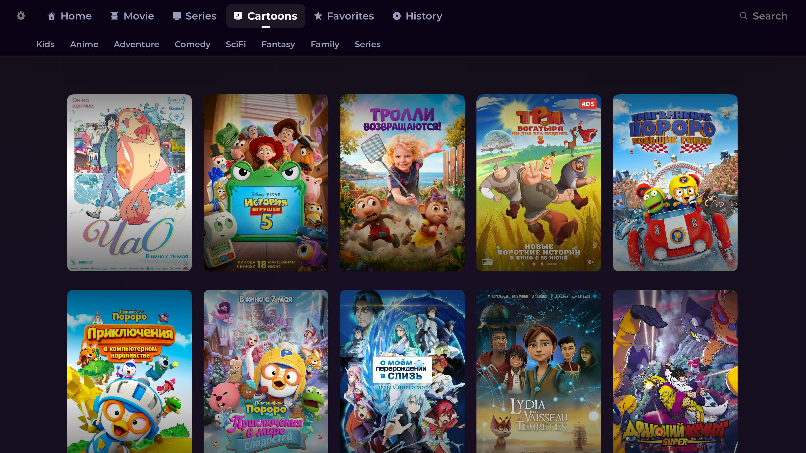
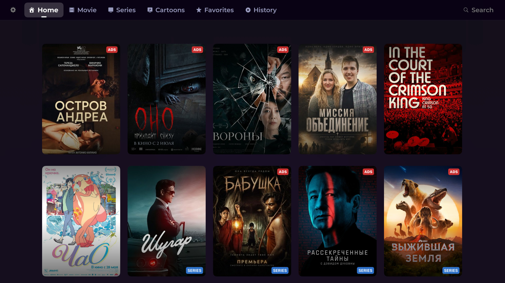
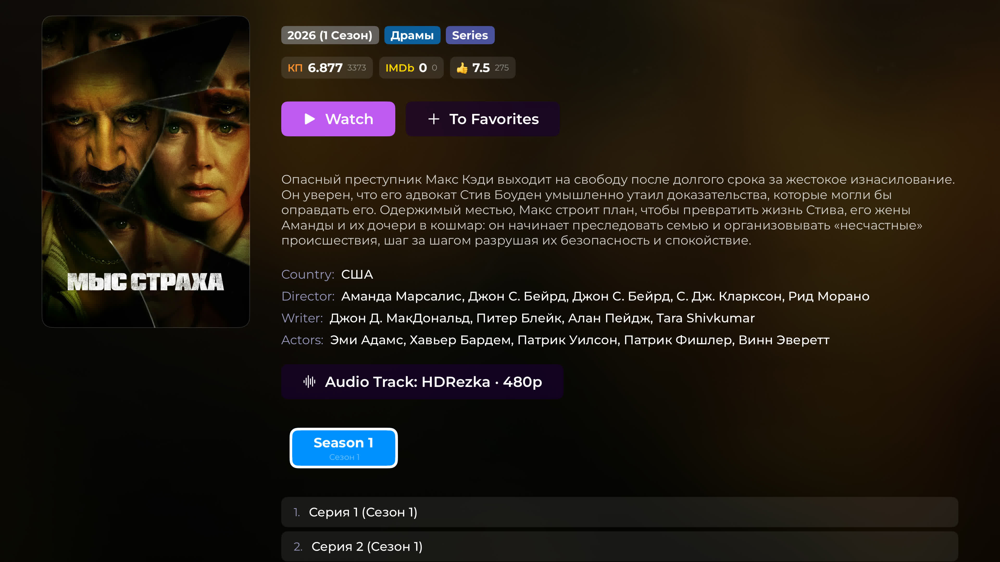
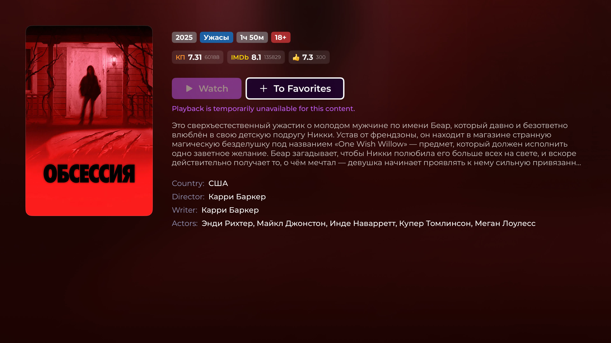
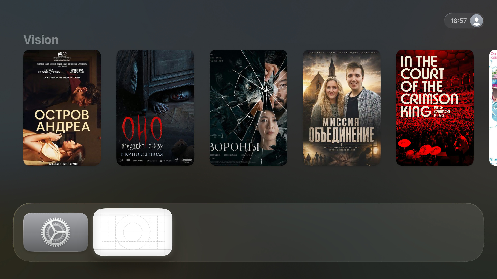

# Vision

An elegant and modern **tvOS** application built with **Swift** and **UIKit** (without Storyboards), following a clean and scalable architecture.

The application is designed to provide a smooth TV experience with fast navigation, optimized performance, and a clean user interface adapted for Apple TV.

---

## ✨ Features

- 📺 Native tvOS application
- 🎬 Browse movies and TV shows
- 🔍 Fast search functionality
- ⭐ Detailed information screen
- 📁 Seasons & Episodes support
- 🎥 Video playback
- 🖼️ Image caching
- 🚀 Optimized for Apple TV Focus Engine
- 🏗️ Clean Architecture
- 💉 Dependency Injection
- 🌍 Localization support
- 📦 Modular project structure
- 🎯 No Storyboards (UIKit only)

---

## 🏛 Architecture

The project follows **Clean Architecture**, separating responsibilities into independent layers.

```
App
│
├── Presentation
├── Domain
├── Data
├── Infrastructure
└── Resources
```

### Layers

- **Presentation**
    - ViewControllers
    - ViewModels
    - Custom UI Components

- **Domain**
    - Business Logic
    - Use Cases

- **Data**
    - Data Sources
    - Repository Implementations

- **Infrastructure**
    - Networking
    - Caching
    - Deep Links
    - Utilities

---

## 🛠 Technologies

- Swift
- UIKit
- tvOS SDK
- AVKit
- Auto Layout
- Dependency Injection
- Clean Architecture
- MVVM
- URLSession
- Image Caching

---

## 📂 Project Structure

```
Vision/
│
├── App/
├── Presentation/
├── Domain/
├── Data/
├── Infrastructure/
├── Resources/
└── TopShelfContent/
```

---

# 📸 Screenshots

| Home |  |
|------|---------|
|  |  |

| Detals                 |  |
|------------------------|---------|
|  |  |

| Top Shelf |
|------------|
|  |

---

## 🚀 Getting Started

### Requirements

- Xcode 16+
- Swift 6+
- tvOS 18+

### Installation

```bash
git clone https://github.com/yourusername/Vision.git
```

Open the project in **Xcode** and run it on:

- Apple TV Simulator
- Apple TV Device

---

## 🎯 Focus

The application is fully optimized for the **Apple TV Focus Engine**, providing smooth navigation using the Siri Remote.

---

## 📦 Top Shelf Extension

The project includes a **Top Shelf Extension**, allowing featured content to appear directly on the Apple TV Home Screen for quick access.

---

## 🌍 Localization

The application supports localization using Apple's localization system (`xcstrings`), making it easy to add additional languages.

---

## 📈 Performance

- Efficient image caching
- Lightweight navigation
- Smooth animations
- Optimized memory usage
- Fast loading screens

---

## 🤝 Contributing

Contributions, issues, and feature requests are welcome.

If you'd like to improve the project, feel free to fork the repository and submit a pull request.

---

## 📄 License

This project is released under the MIT License.

---

## 👨‍💻 Author

Created with ❤️ using Swift and UIKit.